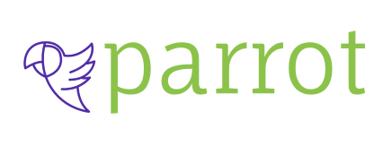

# PARROT

O projeto faz parte do XP43 do curso da Gama Academy e consiste no desenvolvimento de uma rede social para condomínios.
A plataforma permite que os usuários façam publicações que ficam visíveis para toda
comunidade, facilitando a interação entre os condôminos. 


## Tech Stack

React, Redux, Bootstrap, Axios, Sass/CSS


## Instalação
```bash
  npm install
  npm run dev
```

## Authors

- [@tatymota](https://github.com/tatymota)
- [@shinkr99](https://github.com/shinkr99)

## Backend
https://github.com/Noronhakvothe/desafioex
